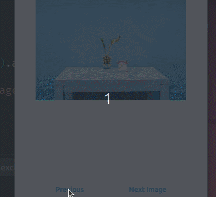

# Image Bloc Tutorial

[video tutorial](https://youtu.be/-vD_kZLiRuA)

## Previous Tutorials

[Flutter BLoC Simple Introduction - Event, State, BLoC](https://youtu.be/drkvsBh2ru8)

## Drill

For repitition.

### Create new project for Bloc

1. New Project: create new project, add flutter_bloc, equatable
1. put Column in MaterialApp. 
    1. Top of Column is random image from https://picsum.photos/
    1. bottom of column is a row with previous and next buttons
    1. set space evenly on row and column 

### Create template bloc files

1. add event, state, bloc files using extension in folder `blocs/image/`

### Add BlocProvider and BlocBuilder

1. BlocProvider: wrap MaterialApp 
1. BlocBuilder: wrap Column

### Configure  State 

1. delete code in `image_state.dart` file. 
1. create new ImageState class that extends Equatable.  
1. Create final int seedNumber. 
1. contructor - change to required
1. equatable
1. toString
1. copyWith
1. factory constructor - ImageState.initial return 10

### Configure Event

1. PreviousImageEvent
1. NextImageEvent

### Configure Bloc

1. on PreviousImageEvent - emit ImageState with seedNumber -1
1. on NextImageEvent

### Show Bloc Information on UI

1. insert seedNumber into URL using string interpolation.  The seed is in the state

## Change Bloc State from Buttons

1. add new state to Bloc stream from previous button
1. add new state from next button
